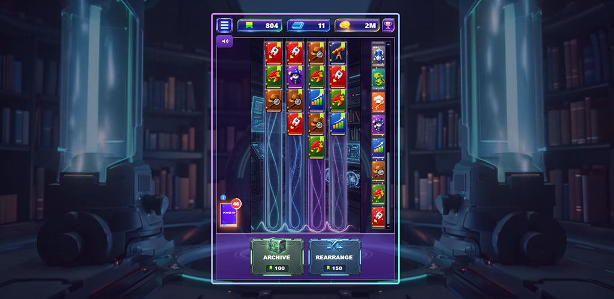
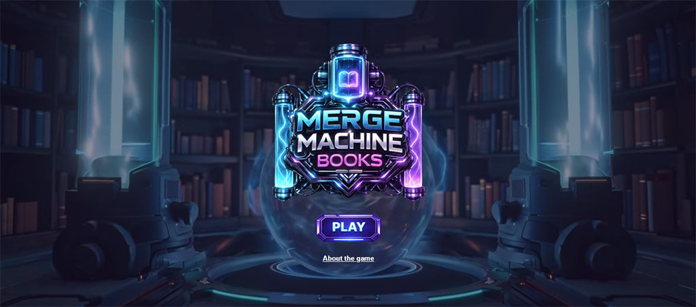
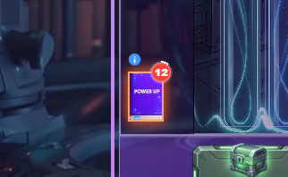

# 📚 Merge Machine Books

> A fast-paced merge game built during **Gamedev.js Jam 2026**  
> Where knowledge becomes a system — and the system becomes a machine.

---

## 🎮 Play the Game

👉 https://www.sprintcodes.com.br/merge-machine-books/

---

## 🖼️ Preview



---


## 🎮 About the Game

Merge Machine Books is a **casual merge game** where players combine books to evolve knowledge and keep the system running.

But here’s the twist:

⚡ **Merges only happen from bottom → top**

---

## 🧠 Core Concept

Instead of building a literal machine (robots, factories…),  
this project explores a different idea:

> A **machine of progression**, driven by knowledge

- Every merge = transformation  
- Every action = part of a system  
- The game never stops  

---

## 🎯 Gameplay Loop

```
Merge → Evolve → Maintain Flow → Optimize → Repeat
```

---

## 🖼️ Gameplay Details

### 📚 Merge System



---

### ⚡ Power-ups



---

### 📦 Archive System


---

## 🧩 Features

- 🔄 Continuous merge system  
- ⬆️ Vertical merge mechanic (unique gameplay)  
- 🎯 Score progression  
- ⚡ Time-based power-ups  
- 📦 Archive & rearrange system  
- 🎵 Audio control system  
- 🎬 WebM animated background (optimized for performance)  

---

## ⚙️ Tech Stack

- HTML  
- CSS  
- JavaScript (Vanilla)  

> No frameworks. No engines. Just pure execution.

---

## 🚀 Why This Project Matters

Built under **game jam constraints**, forcing:

- fast decision making  
- minimalism  
- gameplay-first thinking  
- rapid iteration  

> In a game jam: **speed > perfection**

---

## 🧪 Key Technical Decisions

### ⬆️ Vertical Merge System

Most merge games allow free movement.

This game forces:

```
Bottom → Top only
```

Result:

- unique gameplay identity  
- stronger strategic control  
- cleaner interaction design  

---

### ⚡ Pure Web Stack

Why no engine?

- instant iteration  
- zero setup  
- fast deploy  
- total control  

---

## 🛠️ Want to Fork?

This project is **simple, hackable and expandable**.

You can:

- add new book types  
- create new progression systems  
- tweak merge logic  
- redesign UI/UX  
- experiment with mechanics  

---

## 🧠 Built With AI Support

Tools used:

- Jules  
- Gemini  
- Codex  

> AI helped accelerate — but decisions and implementation were manual.

---

## 📦 Running Locally

```bash
# Just open
index.html
```

---

## 📄 License

This project is licensed under the **MIT License**.

---

## 💡 Roadmap Ideas

- 🏆 Achievements system  
- 📱 Mobile optimization  
- ☁️ Save system  
- 🌍 Leaderboards  
- ⚡ New power-ups  

---

## 🔥 Final Thought

This project is not about complexity.

It’s about:

- execution  
- clarity  
- flow  
- and building something that **feels good to play**

---

## ⭐ Support the Project

If you like it:

- ⭐ Star the repo  
- 🍴 Fork it  
- 📺 Subscribe to the channel  
- 🚀 Share with other devs  

---

## 👨‍💻 Author

**James Moro**  
Dev Mobile & Game Creator

---

## 📺 Subscribe to the Channel

<p align="center">
  <a href="https://www.youtube.com/@SprintCodes">
    
  </a>
</p>

<p align="center">
  🚀 Learn how to build apps and games fast using low code and real projects
</p>

<p align="center">
  
</p>
